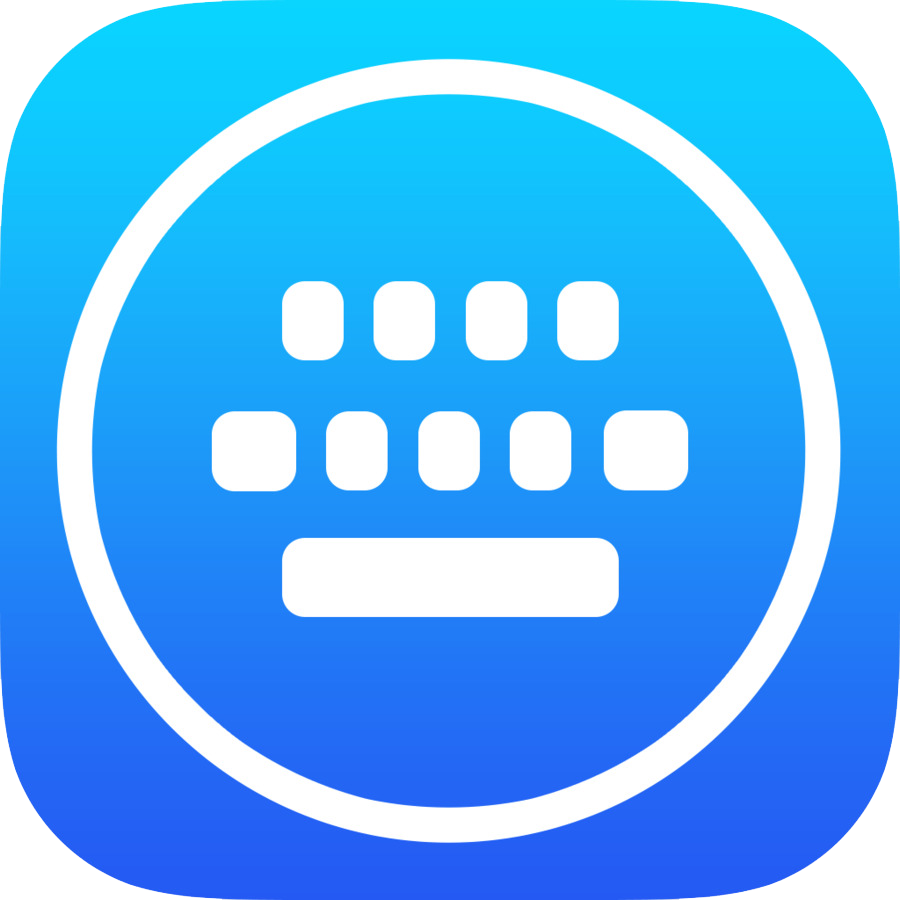

	
	

		
			<h1 align="center">Copy Type</h1>
		
	

	
A simple auto-typer tool for automating keyboard inputs.

 	

		
		
		
	

 

<h2>Overview 📋</h2>

The Auto Typer is a small utility tool designed to automate keyboard inputs on Windows systems. Whether you need to repeatedly type a specific text or simulate keypresses for automation tasks, this tool can save you time and effort.

<h3>Features 🛠️</h3>

- Simulate keyboard inputs with customizable delays.
- Support for typing multiline text and special characters.
- Easy-to-use graphical user interface (GUI).
- Lightweight and portable application.

<h3>How to Use 🚀</h3>

1. Download the latest release of the Auto Typer from the [Releases](https://github.com/Francy93/CopyType/releases) page.
2. Extract the downloaded ZIP file to your desired location.
3. Double-click on the "CopyType.exe" file to launch the application.
4. Copy into the clipboard the text you want to be typed.
5. Adjust the typing speed and any other settings as needed.
6. Click the "Start" button to begin typing. You can stop typing at any time by clicking the "Stop" button.

<h3>Download 📥</h3>

You can download the latest version of the Auto Typer from the following link -> [Download](https://github.com/Francy93/CopyType/releases/download/FirstRelease/CopyType.exe)

<h3>Contributing 🤝</h3>

Contributions are welcome! If you have any ideas for improvements or new features, feel free to open an issue or submit a pull request.

<h3>License 📄</h3>

This project is licensed under the MIT License - see the [LICENSE](LICENSE) file for details.

---

<h3>Instructions for Compiling</h3>

| Command       | Description                                                  |
|---------------|--------------------------------------------------------------|
| `make`        | Build the executable file 'main'.                            |
| `make run`    | Build and run the executable file.                           |
| `make run?..` | Allows passing arguments to the executable (e.g., `make run?arg1` or `make run?'arg1 arg2'`). |
| `make clean`  | Remove every .o and executable files.                        |
| `make remake` | Execute a make clean and subsequently compile all.           |
| `make debug`  | Display more detailed messages.                              |
| `make help`   | Show brief guidelines about this makefile usage.             |
